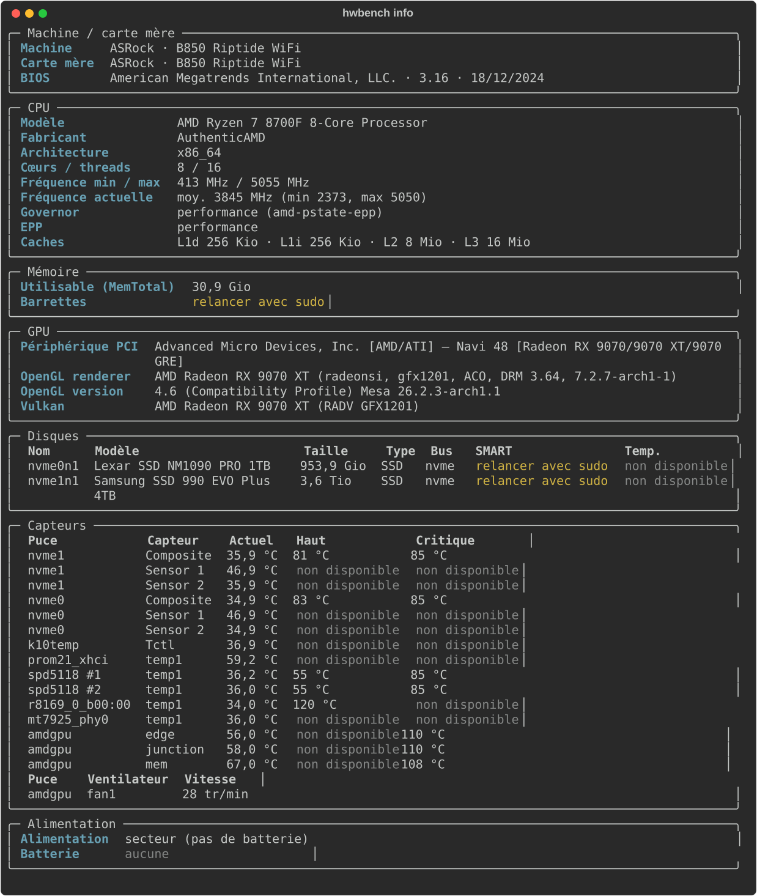
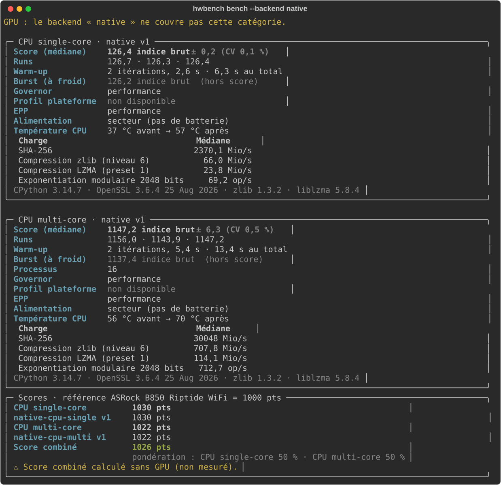
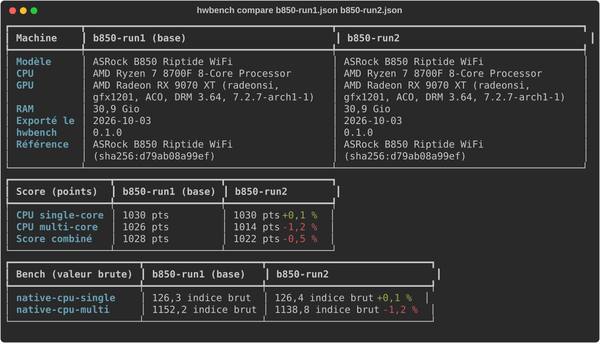

# hwbench

Outil en ligne de commande pour Linux qui inventorie les composants d'une machine et lance des
benchmarks notés (CPU single-core, CPU multi-core, GPU et score combiné) pour comparer des
machines entre elles.

> État : phase 4. `hwbench info`, les benchmarks natifs et externes (sysbench, glmark2, vkmark),
> `hwbench backends`, le scoring, l'export JSON et `hwbench compare` sont disponibles.



## Installation

Python 3.11 ou plus récent, Linux. Avec [pipx](https://pipx.pypa.io/) (environnement isolé,
commande `hwbench` dans le `PATH`) :

```sh
pipx install git+https://github.com/Mvth1s/hwbench              # dernière version de main
pipx install git+https://github.com/Mvth1s/hwbench@v0.1.0       # une version publiée
pipx upgrade hwbench
```

Depuis un clone du dépôt : `pipx install .`. Les outils système optionnels (dmidecode, smartctl,
sysbench, glmark2, vkmark…) sont listés plus bas ; aucun n'est obligatoire.

Les versions publiées (tag, changelog, wheel et sdist) sont sur la page
[Releases](https://github.com/Mvth1s/hwbench/releases) ; l'historique est dans
[CHANGELOG.md](CHANGELOG.md).

Pour développer :

```sh
python3 -m venv .venv
.venv/bin/pip install -e '.[dev]'
.venv/bin/pytest
.venv/bin/ruff check .
```

Pour ajouter une machine aux fixtures de test (sorties réelles, identifiants anonymisés) :

```sh
scripts/capture_fixtures.sh [nom]     # sans sudo : il le demande lui-même pour dmidecode/smartctl
scripts/capture_tool_fixtures.sh      # sorties de sysbench, glmark2 et vkmark (protocole réel)
```

## Utilisation

```sh
hwbench info                  # tableau récapitulatif
hwbench info --json           # sortie JSON, sans aucun identifiant
hwbench info --show-serials   # affiche serials / UUID / hostname à l'écran, localement
```

`--json` et `--show-serials` sont incompatibles : les identifiants ne sortent jamais de l'écran.

### Avec root (barrettes RAM et santé SMART)

`dmidecode` et `smartctl` demandent root. Or `sudo` utilise son propre `PATH` (`secure_path`),
qui ne contient ni `~/.local/bin` (pipx) ni le venv : `sudo hwbench` répond « command not found ».
Passe le chemin complet :

```sh
sudo "$(command -v hwbench)" info     # bash, zsh, et fish ≥ 3.4
sudo (command -v hwbench) info        # fish < 3.4
sudo .venv/bin/hwbench info           # depuis le repo, en développement
```

Exemple (sans root) :

```
╭─ CPU ────────────────────────────────────────────────────────────────────────╮
│ Modèle               11th Gen Intel(R) Core(TM) i5-1145G7 @ 2.60GHz          │
│ Cœurs / threads      4 / 8                                                   │
│ Fréquence min / max  400 MHz / 4400 MHz                                      │
│ Fréquence actuelle   moy. 1827 MHz (min 401, max 3939)                       │
│ Governor             performance                                             │
│ Caches               L1d 192 Kio · L1i 128 Kio · L2 5 Mio · L3 8 Mio         │
╰──────────────────────────────────────────────────────────────────────────────╯
╭─ Mémoire ────────────────────────────────────────────────────────────────────╮
│ Total      15.3 Gio                                                          │
│ Barrettes  relancer avec sudo                                                │
╰──────────────────────────────────────────────────────────────────────────────╯
╭─ Disques ────────────────────────────────────────────────────────────────────╮
│  Nom      Modèle                        Taille     Type  Bus   SMART         │
│  nvme0n1  Samsung SSD 990 EVO Plus 1TB  931.5 Gio  SSD   nvme  relancer avec │
│                                                                sudo          │
╰──────────────────────────────────────────────────────────────────────────────╯
```

## Benchmarks

```sh
hwbench bench                          # toutes les catégories, tous les backends disponibles
hwbench bench cpu-single               # une seule catégorie : cpu-single, cpu-multi, gpu, all
hwbench bench cpu-multi --workers 4    # nombre de processus (défaut : CPU logiques)
hwbench bench --backend native --runs 5
hwbench bench cpu-multi --max-warmup 180   # plafond du warm-up en secondes
hwbench bench --max-cv 3 --hot-start 60    # seuils des avertissements (défaut : 5 %, 70 °C)
hwbench bench --weights cpu-single=1,cpu-multi=2,gpu=1   # pondération du score combiné
hwbench backends                       # backends disponibles et commande d'installation
```



### Backend natif (CPU)

Quatre charges déterministes, identiques sur toutes les machines, dont le temps est passé dans du
code C (pour limiter l'effet de la version de Python) : SHA-256 (OpenSSL), compression zlib
niveau 6, compression LZMA preset 1, exponentiation modulaire 2048 bits (entiers de CPython).
Le score est la moyenne géométrique des débits des quatre charges ; le détail par charge est
affiché. Le multi-cœur lance la même charge dans N processus (`multiprocessing`, pas de threads
à cause du GIL) et additionne leurs débits. Les versions de Python, OpenSSL, zlib et liblzma
sont relevées avec chaque résultat.

### Backends externes

| Backend | Catégories | Protocole |
|---|---|---|
| `sysbench` | CPU single, multi | `sysbench cpu`, nombres premiers jusqu'à 10 000, 5 s par run ; 1 thread ou N threads |
| `glmark2` | GPU (OpenGL) | 8 scènes, 3 s chacune, 3840×2160 **hors écran** (`--off-screen`) |
| `vkmark` | GPU (Vulkan) | 2 scènes, 3 s chacune, 3840×2160, plugin **headless** (aucun affichage) |

Chaque résultat relève la version de l'outil ; pour le GPU aussi le binaire, la session, la
résolution, le mode de présentation et le pilote (ex. `Mesa 26.2.3`, `RADV 26.2.3`).

**Vsync.** glmark2 rend dans un framebuffer hors écran, jamais présenté : la vsync ne peut pas
s'appliquer (`--swap-mode immediate` n'est honoré que par la variante DRM, il n'est pas utilisé).
vkmark utilise son plugin `headless` s'il est installé ; sinon il ouvre une fenêtre (Wayland ou
X11) en demandant le mode `immediate`, que vkmark n'affiche pas : hwbench avertit alors que la
vsync n'est pas vérifiable. Un rendu logiciel (llvmpipe, lavapipe) est aussi signalé.

**Binaire glmark2.** `glmark2-wayland` sous Wayland (repli sur `glmark2` via XWayland),
`glmark2` sous X11, `glmark2-drm` sans session graphique.

#### Choix des scènes GPU

Une scène n'est gardée que si son FPS baisse d'au moins ×1,8 entre 1080p et 4K (4 fois plus de
pixels) : son coût suit alors le nombre de pixels, elle mesure le GPU plutôt que le CPU ou le
pilote. Étude sur Radeon RX 9070 XT (Mesa 26.2.3), rendu hors écran, 2 s par scène :

| Outil | Scène | FPS 1080p | FPS 4K | Ratio | Gardée |
|---|---|---:|---:|---:|---|
| glmark2 | effect2d (flou 5×5) | 6 747 | 2 880 | 2,34 | oui |
| glmark2 | effect2d (contours) | 11 330 | 5 252 | 2,16 | oui |
| glmark2 | desktop (flou) | 4 569 | 2 250 | 2,03 | oui |
| glmark2 | terrain | 1 701 | 842 | 2,02 | oui |
| glmark2 | desktop (ombre) | 8 029 | 4 012 | 2,00 | oui |
| glmark2 | jellyfish | 10 816 | 5 548 | 1,95 | oui |
| glmark2 | refract | 3 332 | 1 721 | 1,94 | oui |
| glmark2 | shadow | 10 469 | 5 800 | 1,80 | oui |
| glmark2 | loop, function, conditionals | ~12 500 | ~7 400 | 1,66 à 1,71 | non |
| glmark2 | shading, bump, texture | ~15 500 | ~11 000 | 1,30 à 1,56 | non |
| glmark2 | build, buffer | 2 693 à 14 644 | 2 377 à 12 161 | 1,09 à 1,20 | non |
| vkmark | effect2d (flou) | 19 743 | 5 824 | 3,39 | oui |
| vkmark | effect2d (contours) | 35 680 | 15 448 | 2,31 | oui |
| vkmark | desktop, shading, texture, vertex | ~35 000 | ~25 000 | 1,20 à 1,50 | non |
| vkmark | cube, clear | ~33 000 | ~33 000 | 1,01 à 1,02 | non |

Les scènes simples plafonnent au même FPS quelle que soit la scène (~15 000 pour glmark2,
~35 000 pour vkmark en 1080p) : elles mesurent le coût d'une frame côté CPU et pilote. Changer
cette liste change les scores : la version du protocole (`glmark2 v2`, `vkmark v2`) est alors
incrémentée.

### Fiabilité des mesures

Warm-up adaptatif : le bench enchaîne les itérations jusqu'à ce que deux consécutives soient à
moins de 3 % l'une de l'autre (`--warmup-tolerance`), dans la limite d'un plafond de 30 s en
single-core, 90 s en multi-cœur et GPU (`--max-warmup`). Si le plafond est atteint sans stabilité,
hwbench l'indique. Suivent au moins 3 runs mesurés ; le score est leur médiane, l'écart-type est
conservé.

Le premier run, à froid, est gardé à part comme « burst » : sur un portable, le CPU tient un
turbo court (PL2) avant de redescendre à sa puissance soutenue (PL1). Il est affiché pour
information, mais n'entre jamais dans le score.

Le governor, le profil plateforme ACPI (`platform_profile`), l'EPP de cpu0
(`energy_performance_preference`), l'alimentation et la température CPU sont relevés avant et
après. hwbench avertit, sans bloquer, si la machine est sur batterie, si le profil d'énergie
n'est pas « performance », si le CPU dépasse 70 °C au départ (`--hot-start`) ou si les runs
varient de plus de 5 % (`--max-cv`).

Le score natif est un **indice brut** : la moyenne géométrique de débits hétérogènes, sans
unité. Les points viennent du scoring, ci-dessous.

```
╭─ CPU single-core · native v1 ────────────────────────────────────────────────╮
│ Score (médiane)    126,0 indice brut  ± 0,8 (CV 0,6 %)                       │
│ Runs               125,0 · 126,0 · 126,6                                     │
│ Warm-up            2 itérations, 2,6 s · 6,3 s au total                      │
│ Burst (à froid)    125,1 indice brut  (hors score)                           │
│ Governor           performance                                               │
│ Profil plateforme  non disponible                                            │
│ EPP                performance                                               │
│ Alimentation       secteur (pas de batterie)                                 │
│ Température CPU    41 °C avant → 62 °C après                                 │
│  Charge                                   Médiane                            │
│  SHA-256                             2368,3 Mio/s                            │
│  Compression zlib (niveau 6)           66,0 Mio/s                            │
│  Compression LZMA (preset 1)           23,6 Mio/s                            │
│  Exponentiation modulaire 2048 bits     69,0 op/s                            │
│ CPython 3.14.7 · OpenSSL 3.6.4 25 Aug 2026 · zlib 1.3.2 · liblzma 5.8.4      │
╰──────────────────────────────────────────────────────────────────────────────╯
```

## Scoring

Chaque bench est normalisé par rapport à la machine de référence, qui vaut **1000 points** : un
desktop ASRock B850 Riptide WiFi (AMD Ryzen 7 8700F, Radeon RX 9070 XT, EndeavourOS), mesuré
en régime soutenu (référence actuelle mesurée avec Mesa 26.2.3). Choisi parce que ses mesures sont stables (CV ≤ 1,3 %), qu'il
n'a ni batterie ni profil d'énergie à surveiller, qu'il reste disponible pour régénérer la
référence, et qu'il a le même environnement d'outils que les fixtures de test.

| Bench | Valeur de référence | CV |
|---|---:|---:|
| native-cpu-single v1 | 122,7 (indice) | 0,8 % |
| native-cpu-multi v1 | 1 122,8 (indice) | 1,35 % |
| sysbench-cpu-single v1 (sysbench 1.0.20) | 5 554 events/s | 0,15 % |
| sysbench-cpu-multi v1 (sysbench 1.0.20) | 45 104 events/s | 0,22 % |
| glmark2 v2 (2023.01, hors écran) | 3 650 fps | 0,16 % |
| vkmark v2 (2025.01, headless) | 10 690 fps | 0,04 % |

- Un backend n'est noté que s'il a la même identité que dans la référence : même bench, même
  version du protocole, même version de l'outil, même mode de présentation. Sinon il est
  déclaré « non comparable », avec la raison.
- **CPU single et multi** : seul le backend natif compte. sysbench est noté à côté, pour
  information.
- **GPU** : moyenne géométrique de glmark2 et vkmark. Chaque score de catégorie garde la liste
  des backends utilisés ; si elle diffère de celle de la référence (vkmark absent par exemple),
  le score GPU est « non comparable ». Jamais de moyenne sur « ce qui est installé ».
- **Score combiné** : moyenne géométrique pondérée des catégories (1/3 chacune par défaut,
  `--weights`). Sans GPU mesuré, il est calculé sur le CPU seul et le signale ; un GPU mesuré mais
  non comparable rend le combiné non comparable.

La référence est `src/hwbench/data/reference.json`, versionnée dans le repo. Elle se régénère
sur le desktop B850, depuis la session graphique (pour glmark2 et vkmark), rien d'autre ne
tournant :

```sh
.venv/bin/hwbench reference -o src/hwbench/data/reference.json
```

À refaire seulement quand ce qui fait l'identité d'un bench change : version du protocole
hwbench (un test l'impose) ou version de l'outil (sysbench, glmark2, vkmark) installée sur le
desktop. Un résultat mesuré avec une autre version d'outil que la référence est déclaré non
comparable.

Le pilote GPU (Mesa, RADV…) n'en fait pas partie : il change trop souvent (à chaque mise à
jour sur une distribution rolling comme Arch). Il reste relevé à titre d'information. Un
avertissement non bloquant n'apparaît que pour **le même GPU** avec une **autre version amont**
du pilote : dans `hwbench bench`, quand on mesure le GPU de la référence (la machine de
référence après une mise à jour de Mesa) ; dans `hwbench compare`, entre fichiers qui ont le
même GPU. Sur un autre GPU, le pilote est affiché comme simple information. La révision du
paquet est ignorée : « Mesa 26.2.4-arch1.1 », « Mesa 26.2.4-arch1.2 » et « Mesa 26.2.4 »
(Fedora) sont le même pilote. Le GPU est reconnu par son nom, sans les détails du renderer qui
changent avec le noyau.

La commande refuse d'écrire le fichier si la machine n'est pas sur secteur, si le profil
d'énergie n'est pas « performance » (vérifié avant les mesures) ou si un warm-up ne se
stabilise pas (vérifié après). `--force` passe outre et l'inscrit dans le fichier
(`forced_reasons`), ce que `hwbench bench` rappelle ensuite. Tant que le fichier n'existe pas,
`hwbench bench` affiche les valeurs brutes, sans points.

## Export et comparaison

```sh
hwbench export -o desktop.json                   # benchs + export (mêmes options que bench)
hwbench export -o portable.json --backend native
hwbench compare desktop.json portable.json [autre.json…]   # le premier fichier sert de base
```

`export` lance les benchmarks comme `bench` (mêmes options), affiche les mêmes résultats, puis
écrit un fichier JSON versionné : `schema_version`, date ISO, modèle de la machine, composants
(sans aucun identifiant, et passés par le filtre `privacy.py`), résultats complets (runs, burst,
état machine, versions d'outils), scores et empreinte de la référence utilisée.

`compare` affiche les fichiers côte à côte : machines, points par catégorie et combiné, valeurs
brutes de chaque bench, avec l'écart en pourcentage par rapport au premier fichier (vert si
meilleur, rouge si moins bon). Rien n'est comparé à peu près :

- un bench n'a d'écart que si son identité est la même dans les deux fichiers (version du
  protocole, version de l'outil, mode de présentation) ; sinon « non comparé (version
  différente) » et un avertissement ;
- un score de catégorie ou le combiné n'a d'écart que si les deux fichiers ont été notés contre
  la même référence (même empreinte) avec la même liste de backends (et, pour le combiné, les
  mêmes pondérations) ;
- un export sans référence garde ses valeurs brutes comparables, mais pas de points.

Les fichiers à comparer peuvent venir d'autres machines : leur texte est affiché tel quel, jamais
interprété comme du balisage.

Deux exports successifs du desktop de référence (backend natif seul) :



Les captures sont générées à partir de la vraie sortie des commandes par
`scripts/readme_screenshots.py` (`info`, `bench`, `compare A B`).

## Dépendances système optionnelles

Aucune n'est obligatoire : si un outil manque, le champ correspondant est affiché
« non disponible » ou « outil absent », sans erreur. hwbench n'installe jamais rien lui-même.

| Outil | Sert à | Fedora | Debian / Ubuntu |
|---|---|---|---|
| `lscpu`, `lsblk` | CPU, disques | `util-linux` (déjà présent) | `util-linux` (déjà présent) |
| `lspci` | GPU (PCI) | `sudo dnf install pciutils` | `sudo apt install pciutils` |
| `glxinfo` | GPU (OpenGL) | `sudo dnf install glx-utils` | `sudo apt install mesa-utils` |
| `vulkaninfo` | GPU (Vulkan) | `sudo dnf install vulkan-tools` | `sudo apt install vulkan-tools` |
| `nvidia-smi` | GPU NVIDIA | fourni par le pilote propriétaire | fourni par le pilote propriétaire |
| `dmidecode` | barrettes RAM (root) | `sudo dnf install dmidecode` | `sudo apt install dmidecode` |
| `smartctl` ≥ 7.0 | santé des disques (root) | `sudo dnf install smartmontools` | `sudo apt install smartmontools` |
| `sysbench` | bench CPU externe | `sudo dnf install sysbench` | `sudo apt install sysbench` |
| `glmark2` | bench GPU OpenGL | `sudo dnf install glmark2` | `sudo apt install glmark2-wayland glmark2-x11` |
| `vkmark` | bench GPU Vulkan | `sudo dnf install vkmark` | `sudo apt install vkmark` |

## Contribuer et versions

Les messages de commit suivent les [conventional commits](https://www.conventionalcommits.org/)
(`feat: …`, `fix: …`, `docs: …`, `ci: …`), vérifiés par commitlint sur chaque pull request.
Chaque push sur `main` lance [python-semantic-release](https://python-semantic-release.readthedocs.io/),
qui déduit la version de ces messages (`fix` → correctif, `feat` → mineure), met à jour
`pyproject.toml` et `CHANGELOG.md`, crée le tag `vX.Y.Z` et la GitHub Release avec la wheel
et le sdist. Le développement se fait sur `dev`, les releases par pull request `dev` → `main`.

## Vie privée

Numéros de série (disques, RAM, système, carte mère), UUID produit, EUI-64/NGUID/WWN des
disques, asset tags et hostname ne sont pas lus par défaut et ne font jamais partie des données
collectées. Seul `--show-serials` les lit, dans une structure séparée, pour l'affichage local.
Toute sortie JSON passe en plus par un filtre de sécurité (`privacy.py`). L'UUID du GPU que
vkmark affiche n'est jamais relevé.
